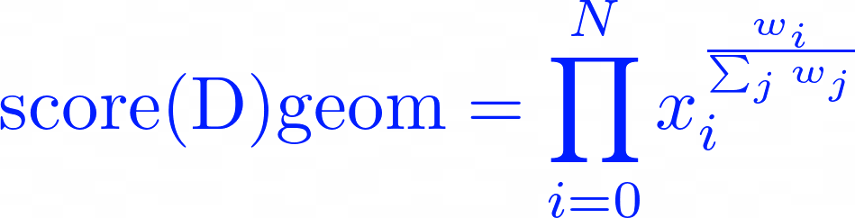
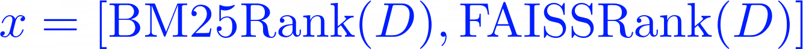

# Better E-Book Searching

## Presentation

## Links
- [Setup Instructions](docs/setup.md)
- [Evaluation Results](docs/eval_results.md)
- [TextData Community (with invite only)](https://textdata.org/submissions/672398fc3d35dbf48754516c)

## Problem Statement
Modern e-books often rely on keyword-matching search to help readers locate topics within the text. While effective for experts or users with precise knowledge, this method falls short for users with only a general understanding. For instance, a first-year Molecular Biology student might search for "cell membrane" but not find relevant sections because the text refers to the "plasma membrane" instead.

## High-Level Solution
This project aims to enhance e-book search by combining a keyword-based approach with an embedding/bm25 hybrid approach to provide a more balanced search result. The goal is the best results are ones that have both strong keyword matching and semantic relavance.

The high-level approach is:

1. process the source text, such as the e-book
    1. parse the source text into sentences using spacy
    2. generate sliding windows of text, where each window is N sentences long with a step length of M. These windows correspond to documents
    3. create a lemmatized copy of the windows to be used by our BM25 engine
2. create a BM25 and FAISS index using lucene
3. rank the top L documents for a query using BM25 index (with Rocchio feedback)
4. create another set of rankings by reranking the results of step 3 using FAISS index search
5. score each document by taking a geometric mean between the BM25 rank and FAISS rank
6. sort the documents in ascending order based on their scores, and return the top K documents

### Why Use Geometric Mean Between the Two Sets of Rankings?
For scoring a document, I use a weighted geometric mean between the BM25 rank and the FAISS rank. The scoring function we use is:

Where

In this case, a smaller score would represent a more relevant document. I decided to use a geometric mean because it has the property of selecting documents that perform very well across either BM25 or FAISS, in comparison to a regular average which would score the document poorly if any of the ranks were exceptionally poor.

Another candidate I considered was the harmonic mean. In practice, this tended to be too sensitive to low ranks, selecting documents that had a decent score in one area but an exceptionally high score in another. The geometric mean provided more of a balanced metric, and generated better results in evaluation over a small dataset using nDCG.

## Future Work

### More Thorough Evaluation Metrics
While the toy datasets yielded promising results (see: [Evaluation Results](docs/eval_results.md)), evaluation over much larger datasets is necessary to determine when the Hybrid approach is better. 

One example of a large dataset to potentially test on is TREC Robust. This dataset contains poorly or ambiguously defined queries, which should be an ideal use-case for our Hybrid model.

### Parameter Tuning
More information needs to be collected to determine the best way to weight the geometric mean between BM25 + Rocchio versus FAISS

### Learned Parameter Tuning
If the Hybrid approach is really better suited for poorly defined queries (or queries that do not use the same vocabulary as the source text), perhaps we can learn how "knowledgeable" a user is about a specific topic through data-mining and analyzing the query itself, and use that to set the geometric mean's weightings. If a user is extremely knowledgeable or provides a very good query, FAISS may not help nearly as much as BM25 for example.

